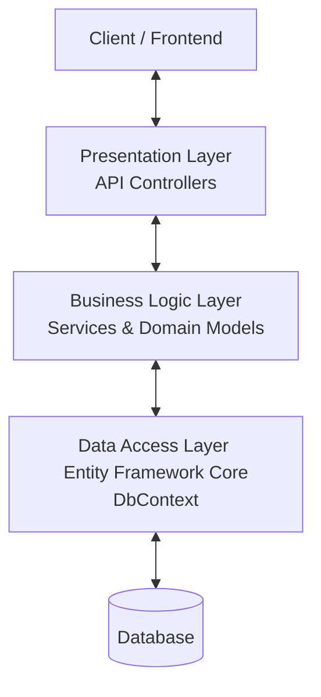

# Kế hoạch Tái cấu trúc Hệ thống: Khắc phục Vấn đề "Fat Controller" và Phân lớp Kiến trúc 3 Lớp (Presentation - Business Logic - Data Access)

Tài liệu này phân tích các vấn đề hiện tại về cấu trúc thư mục, sự phân chia trách nhiệm giữa các lớp trong thư mục `@/server` và đề xuất lộ trình hành động cụ thể để đưa hệ thống về chuẩn kiến trúc **MVC kết hợp 3 lớp (3-Tier/3-Layer Architecture)** sạch sẽ, dễ bảo trì, dễ viết unit test.

---

## 1. Phân Tích Vấn Đề Hiện Tại (Architectural Anti-Patterns)

Hiện tại, nhiều Controller trong hệ thống đang mắc phải lỗi **"Fat Controller"** (Controller quá béo) - tức là Controller đang gánh vác quá nhiều trách nhiệm cùng một lúc. Điều này vi phạm nghiêm trọng nguyên lý **Single Responsibility Principle (SRP)** và làm suy yếu kiến trúc phân lớp.

### Các dấu hiệu vi phạm cụ thể:
1. **Truy vấn trực tiếp Database từ Controller**: Nhiều Controller trực tiếp inject `ApplicationDbContext` và thực hiện các câu truy vấn phức tạp (`Include`, `Where`, `Select`, DTO Projection) ngay trong các Action.
2. **Xử lý Logic nghiệp vụ (Business Logic) trong Controller**:
   - `ProvincesSearchController` trực tiếp tính khoảng cách Levenshtein, loại bỏ dấu tiếng Việt (diacritics), chấm điểm mức độ khớp (scoring) để tìm kiếm địa phương.
   - `TripDetailController` thực hiện logic kiểm tra trạng thái chuyến đi (`TripStatus.Scheduled`), trạng thái đánh giá, gom nhóm dữ liệu phòng vé/giữ ghế trực tiếp trong API Action.
   - `SystemAdminManagementController` chứa logic đồng bộ Profile khách hàng (`SyncPassengerProfileAsync`), mã hóa mật khẩu (`PasswordHasher`), kiểm tra điều kiện xóa người dùng (không cho xóa nếu đã phát sinh dữ liệu giao dịch), quản lý giao dịch DB.
3. **Phụ thuộc chặt chẽ (Tight Coupling)**: Các Controller bị gắn chặt với Entity Framework Core và cấu trúc DB. Khi có sự thay đổi về schema database hoặc cấu trúc bảng, lập trình viên sẽ phải sửa code trực tiếp trong Controller, làm tăng rủi ro phát sinh lỗi API.
4. **Khó viết Unit Test**: Do logic nghiệp vụ nằm hoàn toàn trong Controller và phụ thuộc vào `ApplicationDbContext` (được cấu hình qua DI), việc kiểm thử tự động (Unit Testing) các luồng xử lý nghiệp vụ sẽ cực kỳ khó khăn nếu không mock toàn bộ DbContext và HttpContext.

---

## 2. Mô hình Kiến trúc Chuẩn Đề xuất (Target Architecture)

Chúng ta cần tách biệt rõ ràng trách nhiệm của hệ thống theo mô hình 3 lớp chuẩn:



### Chi tiết vai trò từng lớp:
*   **Presentation Layer (API Controllers)**:
    *   *Trách nhiệm*: Nhận request từ Client, kiểm tra tính hợp lệ cơ bản của dữ liệu đầu vào (như định dạng email, các trường bắt buộc thông qua Data Annotations trên DTO), định tuyến (Routing), kiểm tra phân quyền (Authorization Attributes), gọi Service tương ứng, xử lý Exception và trả về HTTP Status Code phù hợp (`200 OK`, `201 Created`, `400 BadRequest`, `404 NotFound`).
    *   *Điều cấm kỵ*: **Không** inject `ApplicationDbContext`, **không** viết câu truy vấn LINQ, **không** tính toán logic nghiệp vụ phức tạp.
*   **Business Logic Layer (Services - Lớp Nghiệp Vụ)**:
    *   *Trách nhiệm*: Chứa toàn bộ quy tắc nghiệp vụ, tính toán dữ liệu, kiểm tra trạng thái logic (như "Chuyến đi đã hoàn thành chưa?", "Ghế này đã bị đặt chưa?"), điều phối giao dịch (Transactions), ánh xạ Entity sang DTO.
    *   *Giao tiếp*: Nhận đầu vào là các DTO nguyên bản từ Controller, truy vấn database thông qua `ApplicationDbContext` được inject vào Service, xử lý nghiệp vụ và ném ra các **Domain Exceptions** cụ thể (ví dụ: `NotFoundException`, `ValidationException`) nếu có lỗi nghiệp vụ.
*   **Data Access Layer (Data - Lớp Truy Cập Dữ Liệu)**:
    *   *Trách nhiệm*: Tương tác trực tiếp với Database. Hệ thống hiện tại đang sử dụng Entity Framework Core với `ApplicationDbContext` đóng vai trò là một *Unit of Work* và các `DbSet<T>` đóng vai trò là các *Repositories*. Đây là lựa chọn phù hợp và thực tế cho ASP.NET Core, không cần thiết phải bọc thêm một lớp Repository Pattern tự chế trừ khi có nhu cầu chuyển đổi ORM (tránh Over-engineering).

---

## 3. Bản Mẫu Đối Chiếu (Reference Pattern)

Rất may mắn, trong codebase hiện tại đã có những khu vực thiết kế cực kỳ chuẩn chỉ theo đúng kiến trúc này. Chúng ta sẽ lấy đây làm chuẩn mực để chuyển đổi các phần còn lại:

### Luồng chuẩn: `BookingsController` & `BookingServices`

1.  **`IBookingService` & `BookingService`** ([BookingServices.cs](file:///e:/________thuMucHoc/PBL3/pbl3/server/Services/BookingServices.cs)):
    *   Chứa toàn bộ logic kiểm tra ghế trống, kiểm tra điểm đón/trả hợp lệ, tạo thực thể `Booking` và `Ticket`, lưu xuống database bằng `_context.SaveChangesAsync()`.
    *   Ném ra `KeyNotFoundException` hoặc `InvalidOperationException` khi dữ liệu không hợp lệ hoặc vi phạm quy tắc.
2.  **`BookingsController`** ([Bookings.cs](file:///e:/________thuMucHoc/PBL3/pbl3/server/Controllers/Users/Bookings.cs)):
    *   Cực kỳ sạch sẽ. Chỉ nhận DTO, gọi Service qua Dependency Injection, bắt lỗi cụ thể bằng khối `try-catch` và chuyển đổi ngoại lệ thành kết quả HTTP tương ứng.

```csharp
// ĐÂY LÀ MẪU CONTROLLER CHUẨN CẦN HƯỚNG TỚI
[HttpPost]
public async Task<IActionResult> CreateBooking([FromBody] CreateBookingRequestDto dto)
{
    try
    {
        var userId = _currentUserContext.GetRequiredUserId();
        var result = await _bookingService.CreateBookingAsync(dto, userId);
        return CreatedAtAction(nameof(GetBooking), new { bookingId = result.BookingId }, result);
    }
    catch (KeyNotFoundException ex)
    {
        return NotFound(new { message = ex.Message });
    }
    catch (InvalidOperationException ex)
    {
        return BadRequest(new { message = ex.Message });
    }
}
```

---

## 4. Các Vấn Đề Cần Làm Để Khắc Phục (Action Plan)

Dưới đây là danh sách các đầu việc và lộ trình tái cấu trúc cụ thể:

### Đầu việc 1: Chuyển đổi Logic Tìm Kiếm Địa Phương (`ProvincesSearchController`)
*   **Vị trí hiện tại**: [Controllers/Users/Search.cs](file:///e:/________thuMucHoc/PBL3/pbl3/server/Controllers/Users/Search.cs)
*   **Vấn đề**: Hàm `RemoveDiacritics`, `LevenshteinDistance`, và toàn bộ thuật toán tính điểm tìm kiếm khớp nằm hoàn toàn trong Controller.
*   **Giải pháp khắc phục**:
    1.  Tạo interface `ILocationSearchService` và class triển khai `LocationSearchService` trong thư mục `Services/`.
    2.  Di chuyển các hàm phụ trợ `RemoveDiacritics`, `LevenshteinDistance` và logic tìm kiếm phân cấp từ Controller sang `LocationSearchService`.
    3.  Controller chỉ inject `ILocationSearchService`, gọi hàm `SearchProvincesAsync(string query)` và trả về dữ liệu.

### Đầu việc 2: Chuyển đổi Logic Chi Tiết Chuyến Đi & Đánh Giá (`TripDetailController`)
*   **Vị trí hiện tại**: [Controllers/Users/TripDetail.cs](file:///e:/________thuMucHoc/PBL3/pbl3/server/Controllers/Users/TripDetail.cs)
*   **Vấn đề**: Các API `GetTripDetail`, `GetTripSeats`, `GetTripReviews` và `CreateReview` chứa các câu lệnh LINQ truy vấn DB trực tiếp rất phức tạp cùng logic kiểm tra điều kiện tạo đánh giá.
*   **Giải pháp khắc phục**:
    1.  Tạo interface `ITripDetailService` và class triển khai `TripDetailService`.
    2.  Di chuyển logic lấy thông tin chi tiết chuyến đi, tính toán số ghế trống/giữ ghế (`BuildTripSeatsAsync`), lấy danh sách đánh giá của chuyến đi vào `TripDetailService`.
    3.  Di chuyển logic kiểm tra đặt vé hoàn thành, tránh spam đánh giá trùng lặp và tạo Review mới vào Service.
    4.  Cập nhật `TripDetailController` để chỉ đóng vai trò định tuyến và gọi sang Service.

### Đầu việc 3: Tái cấu trúc Hệ thống Quản trị Người dùng (`SystemAdminManagementController`)
*   **Vị trí hiện tại**: [Controllers/Admin/SystemAdminManagement.Users.cs](file:///e:/________thuMucHoc/PBL3/pbl3/server/Controllers/Admin/SystemAdminManagement.Users.cs) (và các file partial đi kèm như `SystemAdminManagement.Get.cs`, `SystemAdminManagement.Update.cs`, v.v.)
*   **Vấn đề**: Đây là lớp quản trị viên hệ thống khổng lồ chứa hàng nghìn dòng code truy vấn database phức tạp, logic phân trang, lọc, sắp xếp động (Dynamic Query), đồng bộ dữ liệu `Passenger` từ `User`, mã hóa mật khẩu, kiểm tra ràng buộc khóa ngoại trước khi xóa người dùng.
*   **Giải pháp khắc phục**:
    1.  Tạo interface `IUserManagementService` và class triển khai `UserManagementService`.
    2.  Di chuyển logic truy vấn người dùng (có phân trang, tìm kiếm, lọc theo vai trò/trạng thái và sắp xếp động) vào `UserManagementService.GetUsersAsync(...)`.
    3.  Di chuyển hàm đồng bộ `SyncPassengerProfileAsync` và các logic kiểm tra khi tạo/cập nhật/xóa tài khoản (mã hóa mật khẩu bằng `_passwordHasher`, kiểm tra dữ liệu giao dịch phát sinh trước khi xóa) vào Service.
    4.  Thu gọn `SystemAdminManagementController` để chỉ thực hiện vai trò nhận dữ liệu quản trị đầu vào, gọi Service và trả về DTO.

### Đầu việc 4: Tái cấu trúc Logic Hoàn tiền (`RefundManagementController`)
*   **Vị trí hiện tại**: [Controllers/Admin/RefundManagement.cs](file:///e:/________thuMucHoc/PBL3/pbl3/server/Controllers/Admin/RefundManagement.cs)
*   **Vấn đề**: API lọc danh sách yêu cầu hoàn tiền, tổng hợp báo cáo (Summary stats), phê duyệt (`ApproveRefund`) và từ chối (`RejectRefund`) chứa logic nghiệp vụ, khởi tạo thực thể `Refund` và tích hợp cổng thanh toán bên thứ ba (`_paymentService.ProcessRefundAsync`) trực tiếp bên trong Controller.
*   **Giải pháp khắc phục**:
    1.  Tạo interface `IRefundManagementService` và class triển khai `RefundManagementService` kế thừa.
    2.  Di chuyển toàn bộ logic truy vấn phân trang, tìm kiếm chữ thường, lọc ngày/trạng thái và tính toán thống kê tổng số tiền hoàn vào Service.
    3.  Di chuyển logic nghiệp vụ duyệt/từ chối hoàn tiền vào Service. Xử lý an toàn phương thức hoàn tiền qua cổng thanh toán (`ProcessRefundAsync`) bằng cấu trúc `try-catch` và trả về kết quả trạng thái hoặc cảnh báo.
    4.  Controller chỉ inject `IRefundManagementService`, gọi Service tương ứng và ánh xạ kết quả HTTP phù hợp.

### Đầu việc 5: Thiết lập Cơ chế Quản lý Ngoại lệ Toàn cục (Global Exception Handling)
*   **Vấn đề**: Các Controller đang lặp đi lặp lại rất nhiều khối `try-catch` để bắt `KeyNotFoundException` hay `InvalidOperationException` và chuyển đổi sang JSON `{ message = ex.Message }`. Việc này gây loãng code Controller.
*   **Giải pháp khắc phục**:
    1.  Xây dựng một **Custom Exception Middleware** hoặc sử dụng **`IExceptionHandler`** (được giới thiệu từ .NET 8).
    2.  Đăng ký Exception Handler này vào `Program.cs`. Nó sẽ tự động bắt tất cả các ngoại lệ chưa được xử lý từ tầng Service ném lên, đọc kiểu ngoại lệ và tự động chuyển đổi sang định dạng **Problem Details (RFC 7807)** chuẩn với HTTP Status Code phù hợp (ví dụ: `KeyNotFoundException` tự động trả về `404 Not Found`).
    3.  Nhờ đó, lập trình viên có thể lược bỏ hoàn toàn các khối `try-catch` rườm rà trong Controller, giúp code Controller cực kỳ ngắn gọn và tập trung.

---

## 5. Ví Dụ Chuyển Đổi Thực Tế (Before & After)

Dưới đây là minh họa cách chuyển đổi mã nguồn từ phong cách cũ sang phong cách kiến trúc 3 lớp mới.

### Tình huống: Tìm kiếm Tỉnh/Thành phố (`ProvincesSearchController`)

#### ❌ TRƯỚC KHI TÁI CẤU TRÚC (Fat Controller)
```csharp
[ApiController]
[Route("api/landing/provinces/search")]
public class ProvincesSearchController : ControllerBase
{
    private readonly ApplicationDbContext _context;
    public ProvincesSearchController(ApplicationDbContext context) => _context = context;

    [HttpGet]
    public async Task<ActionResult<List<ProvinceResponse>>> Search([FromQuery] string? query)
    {
        if (string.IsNullOrWhiteSpace(query))
            return BadRequest(new { message = "Query is required." });

        // Logic xử lý chuỗi diacritics tiếng Việt rườm rà...
        // Logic tính toán khoảng cách Levenshtein...
        // Truy vấn trực tiếp DB & Project dữ liệu DTO...
        var provinces = await _context.Provinces.Include(p => p.Districts).ToListAsync();
        var matches = new List<SearchMatchItem>();
        
        // ...vòng lặp chấm điểm và sắp xếp phức tạp nằm ngay tại đây...

        return Ok(groupedProvinces);
    }
}
```

####   SAU KHI TÁI CẤU TRÚC (Chuẩn 3 lớp + Tách biệt nghiệp vụ)

**Bước 1: Tạo Service Interface**
```csharp
namespace Pbl3.Services
{
    public interface ILocationSearchService
    {
        Task<List<ProvinceResponse>> SearchProvincesAsync(string query);
    }
}
```

**Bước 2: Xây dựng Service Class chứa toàn bộ logic xử lý**
```csharp
namespace Pbl3.Services
{
    public class LocationSearchService : ILocationSearchService
    {
        private readonly ApplicationDbContext _context;
        public LocationSearchService(ApplicationDbContext context) => _context = context;

        public async Task<List<ProvinceResponse>> SearchProvincesAsync(string query)
        {
            if (string.IsNullOrWhiteSpace(query))
                throw new ArgumentException("Từ khóa tìm kiếm không được để trống.");

            // TẤT CẢ LOGIC TÌM KIẾM, LEVENSHTEIN, DIACRITICS ĐÃ ĐƯỢC CHUYỂN VỀ ĐÂY
            var provinces = await _context.Provinces
                .AsNoTracking()
                .Include(p => p.Districts)
                    .ThenInclude(d => d.Wards)
                .ToListAsync();

            var matches = new List<SearchMatchItem>();
            // ...thực hiện thuật toán tính toán điểm khớp...
            
            return groupedProvinces; // trả về kết quả DTO sạch sẽ
        }
        
        private static string RemoveDiacritics(string text) { ... }
        private static int LevenshteinDistance(string s, string t) { ... }
    }
}
```

**Bước 3: Đăng ký Service vào Container DI (`Program.cs`)**
```csharp
builder.Services.AddScoped<ILocationSearchService, LocationSearchService>();
```

**Bước 4: Controller mới siêu mỏng (Thin Controller)**
```csharp
[ApiController]
[Route("api/landing/provinces/search")]
[Tags("Search")]
public class ProvincesSearchController(ILocationSearchService searchService) : ControllerBase
{
    private readonly ILocationSearchService _searchService = searchService;

    [HttpGet]
    [AllowAnonymous]
    public async Task<IActionResult> Search([FromQuery(Name = "query")] string? query)
    {
        try
        {
            var result = await _searchService.SearchProvincesAsync(query);
            return Ok(result);
        }
        catch (ArgumentException ex)
        {
            return BadRequest(new { message = ex.Message });
        }
    }
}
```

---

## 6. Lợi Ích Rõ Rệt Sau Khi Áp Dụng Refactor
1.  **Dễ bảo trì**: Mọi thay đổi về thuật toán tìm kiếm hoặc quy định nghiệp vụ về chi tiết chuyến đi chỉ diễn ra ở một nơi duy nhất: **Service layer**. API Controller hoàn toàn không bị ảnh hưởng.
2.  **Khả năng viết Unit Test độc lập**: Giờ đây, chúng ta có thể dễ dàng viết Unit Test cho `LocationSearchService` bằng cách truyền vào một mock DbContext (hoặc sử dụng EF Core InMemory Provider) mà không cần lo lắng về luồng HTTP Request, ClaimsPrincipal, Routing.
3.  **Tách biệt mối quan tâm (Separation of Concerns)**: Lập trình viên tập trung phát triển nghiệp vụ trên Service, trong khi Controller chỉ quản trị các mối quan tâm hạ tầng web (CORS, SSL, Routing, Authentication, Cache Headers).
4.  **Tái sử dụng mã nguồn (Reusability)**: Ví dụ, phương thức lấy ghế trống của chuyến xe (`BuildTripSeatsAsync`) có thể được tái sử dụng bởi cả `TripDetailService` và `BookingService` mà không bị phụ thuộc chéo hoặc gọi lẫn nhau qua API Controller.

---

## 7. Các Lỗi Thường Gặp Sau Khi Tái Cấu Trúc và Biện Pháp Phòng Ngừa (Risks & Prevention)

Việc tái cấu trúc một hệ thống Web API ASP.NET Core từ kiến trúc "Fat Controller" sang phân lớp "3-Tier Services" chứa đựng một số rủi ro kỹ thuật. Dưới đây là 5 lỗi phổ biến nhất và các biện pháp kỹ thuật để phòng tránh tuyệt đối:

### ⚠️ Rủi ro 1: Lỗi Dịch Truy Vấn EF Core (EF Core Query Translation Failure)
*   **Mô tả**: Khi chuyển logic LINQ từ Controller sang Service, bạn có thể vô tình đưa các phương thức C# thuần (không thể dịch sang SQL, ví dụ: `RemoveDiacritics`, `LevenshteinDistance`, `ToString()`, các phép toán Custom) vào bên trong biểu thức `Where` hoặc `Select` trước khi câu lệnh được thực thi dưới Database. EF Core sẽ ném lỗi `InvalidOperationException` ở runtime.
*   **Biện pháp phòng ngừa**:
    *   Nhận diện rõ ranh giới giữa truy vấn database và xử lý trên bộ nhớ.
    *   Luôn gọi `.ToListAsync()`, `.ToArrayAsync()` hoặc `.AsEnumerable()` để tải dữ liệu thô về bộ nhớ trước khi thực hiện các phép xử lý chuỗi đặc thù hoặc gọi hàm C# tùy biến.
    *   *Ví dụ trong tìm kiếm địa phương*: Tải danh sách Province/District thô về trước bằng `.ToListAsync()`, sau đó mới chạy vòng lặp tính khoảng cách Levenshtein in-memory.

### ⚠️ Rủi ro 2: Lỗi Theo Dõi Thực Thể (EF Core Tracking Collision)
*   **Mô tả**: Lỗi `"The instance of entity type 'User' cannot be tracked because another instance with the same key is already being tracked."` xảy ra khi hai hàm Service khác nhau cùng load hoặc thao tác trên cùng một Entity ID trong cùng một phạm vi Request (do dùng chung Scoped `DbContext`).
*   **Biện pháp phòng ngừa**:
    *   Áp dụng quy tắc **"Read-Only = No Tracking"**: Luôn gọi `.AsNoTracking()` đối với mọi truy vấn chỉ để hiển thị hoặc kiểm tra điều kiện (ví dụ: tìm kiếm chuyến đi, đếm số lượng người dùng).
    *   Chỉ bỏ `.AsNoTracking()` đối với các thực thể thực sự cần thay đổi trạng thái và gọi `SaveChangesAsync()`.
    *   Đảm bảo vòng đời của `ApplicationDbContext` trong container DI được cấu hình là `Scoped` (mặc định của ASP.NET Core), giúp mỗi HTTP request sở hữu một phiên giao dịch DbContext riêng biệt, tránh xung đột chéo request.

### ⚠️ Rủi ro 3: Phụ Thuộc Vòng Quanh (Circular Dependency Loop) trong DI Container
*   **Mô tả**: Khi tách ra các Service độc lập, bạn có thể vô tình thiết kế: `UserService` inject `BookingService` để kiểm tra lịch sử đặt vé, trong khi `BookingService` lại inject `UserService` để kiểm tra hồ sơ khách hàng. Lúc này, ASP.NET Core sẽ crash ngay khi khởi động và báo lỗi: `Circular dependency detected`.
*   **Biện pháp phòng ngừa**:
    *   **Nguyên tắc một chiều**: Lớp dịch vụ cấp cao có thể gọi lớp dịch vụ cấp thấp, nhưng ngược lại thì không.
    *   Nếu hai Service cần gọi lẫn nhau, hãy tách phần logic dùng chung ra một Service thứ ba độc lập (ví dụ: `UserValidationHelper` hoặc `ProfileSyncService`).
    *   Sử dụng cơ chế Domain Event (như thư viện MediatR) để các dịch vụ giao tiếp gián tiếp qua Event (ví dụ: khi `Booking` thành công, phát đi sự kiện `BookingCreatedEvent`, `UserService` lắng nghe sự kiện này để cập nhật thông tin thay vì gọi trực tiếp).

### ⚠️ Rủi ro 4: Mất Ngữ Cảnh Người Dùng (User Context Loss)
*   **Mô tả**: Trong Controller, việc lấy UserId hiện tại rất dễ dàng qua `User.FindFirst(...)` hoặc `HttpContext`. Nếu bạn mang cả đối tượng `HttpContext` vào Service, Service của bạn sẽ bị phụ thuộc chặt chẽ vào hạ tầng Web API, làm mất đi khả năng chạy dưới dạng Background Worker, Cron Job hoặc gRPC Service sau này.
*   **Biện pháp phòng ngừa**:
    *   **Tham số hóa dữ liệu định danh**: Thiết kế các phương thức Service nhận `Guid userId` như một tham số tường minh (ví dụ: `Task ApproveRefund(Guid refundId, Guid processedByUserId)`).
    *   Controller sẽ chịu trách nhiệm trích xuất UserId từ Token/Claims và truyền UserId đó vào Service.
    *   Hoặc sử dụng một interface trừu tượng như `ICurrentUserContext` (đã có sẵn trong dự án của bạn) được triển khai thông qua `IHttpContextAccessor` để Service lấy thông tin người dùng một cách an toàn mà không phụ thuộc trực tiếp vào Web Context.

### ⚠️ Rủi ro 5: Lỗi Lưu Trữ Nửa Chừng (Partial Save & Transaction Issues)
*   **Mô tả**: Khi một nghiệp vụ phức tạp yêu cầu lưu dữ liệu vào nhiều bảng khác nhau. Nếu Service A thực hiện `SaveChangesAsync()` rồi gọi Service B, nhưng Service B bị lỗi đột ngột, dữ liệu của Service A đã được ghi xuống DB và không thể tự động thu hồi (rollback), gây mất nhất quán dữ liệu.
*   **Biện pháp phòng ngừa**:
    *   **Nguyên tắc Unit of Work**: Tránh gọi `_context.SaveChangesAsync()` nhiều lần trong các hàm con hoặc Service con. Chỉ gọi **duy nhất một lần** ở phương thức Service chính (Orchestrator) ngoài cùng sau khi tất cả các bước chuẩn bị dữ liệu đã hoàn tất.
    *   Đối với các nghiệp vụ tài chính, hoàn tiền hoặc đặt vé cần độ an toàn tuyệt đối, hãy sử dụng giao dịch tường minh (Explicit Transactions):
        ```csharp
        using var transaction = await _context.Database.BeginTransactionAsync();
        try
        {
            // Các thao tác nghiệp vụ ghi dữ liệu...
            await _context.SaveChangesAsync();
            
            // Xử lý thanh toán/bên thứ ba...
            await transaction.CommitAsync();
        }
        catch (Exception)
        {
            await transaction.RollbackAsync();
            throw;
        }
        ```

